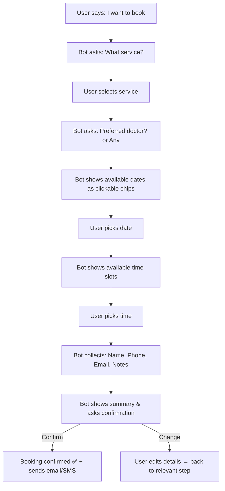
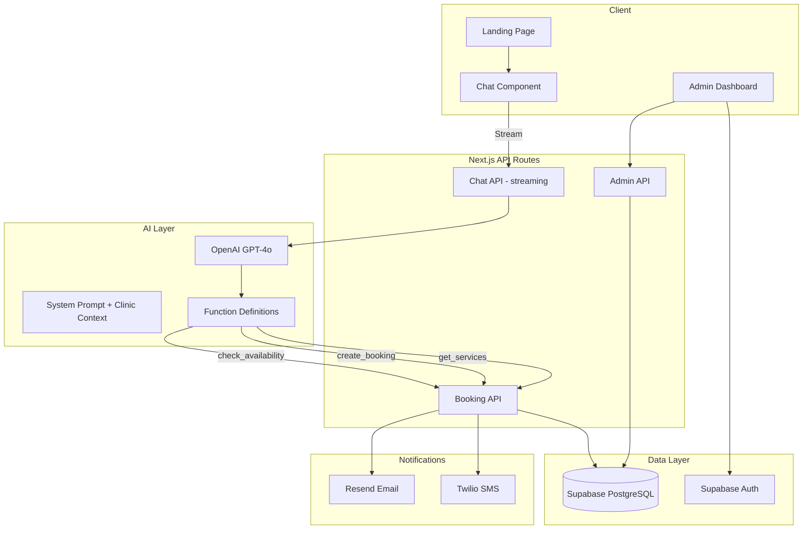

# PRD: DentistAI  -  AI-First Dental Clinic Website

## 1. Vision & Problem Statement

Traditional dental clinic websites are static brochures with buried contact info and clunky booking forms. Patients bounce because they can't get quick answers or book without friction.

**DentistAI** flips the paradigm: the **entire landing page revolves around an AI chatbot** as the primary CTA. Instead of a "Book Now" button leading to a form, users land on a page where the first thing they see  -  and interact with  -  is a conversational interface that can answer questions, recommend services, and **complete a booking end-to-end within the chat**.

---

## 2. Target Users

| Persona | Description |
|---|---|
| **New Patient** | Searching for a dentist, wants quick answers about services/pricing, and wants to book immediately |
| **Returning Patient** | Needs to schedule follow-ups, ask about post-treatment care |
| **Emergency Patient** | Has urgent dental pain, needs to know availability NOW |
| **Clinic Admin** | Manages the appointment calendar, views bookings, configures chatbot responses |

---

## 3. Core Concept: Chat-First CTA

> [!IMPORTANT]
> The hero section does NOT have a traditional "Book Now" button. Instead, it features an **embedded chat component**  -  a visible, ready-to-type input area with suggested prompts. This is the primary conversion mechanism.

### Chat-First CTA Component Spec

```
┌─────────────────────────────────────────────────────┐
│                                                     │
│         Your AI Dental Assistant                    │
│         Ask anything or book an appointment         │
│                                                     │
│  ┌───────────────────────────────────────────────┐  │
│  │  💬 "I'd like to book a cleaning..."          │  │
│  └───────────────────────────────────────────────┘  │
│                                                     │
│  Suggested:                                         │
│  ┌──────────────┐ ┌───────────────┐ ┌────────────┐ │
│  │ Book a visit  │ │ Our services  │ │ Pricing    │ │
│  └──────────────┘ └───────────────┘ └────────────┘ │
│                                                     │
└─────────────────────────────────────────────────────┘
```

- The chat input is **always visible** in the hero  -  no "open chat" trigger needed
- Typing or clicking a suggestion pill **expands into a full chat panel** (slide-up or modal)
- The expanded chat panel supports the full conversational booking flow
- A floating chat FAB persists on scroll for re-access after leaving the hero

---

## 4. Feature Requirements

### 4.1 Landing Page

| Section | Description | Priority |
|---|---|---|
| **Hero + Chat CTA** | Full-width hero with headline, subheadline, and the embedded chat component. Background: clean dental imagery or subtle gradient. | P0 |
| **Services Overview** | Card grid: General Dentistry, Cosmetic, Orthodontics, Implants, Emergency, Pediatric. Each card links to detail or triggers chatbot context. | P0 |
| **Why Choose Us** | Trust signals: years of experience, number of patients, awards, certifications. Animated counters on scroll. | P1 |
| **Meet the Team** | Doctor profiles with photos, specializations, credentials. | P1 |
| **Testimonials** | Patient reviews carousel with star ratings. | P1 |
| **Before & After Gallery** | Image comparison slider for cosmetic cases. | P2 |
| **Insurance & Pricing** | Accepted insurances, transparent pricing tiers. | P1 |
| **Location & Hours** | Embedded map, address, operating hours, contact info. | P0 |
| **Footer** | Links, social media, privacy policy, emergency number. | P0 |

### 4.2 AI Chatbot

> [!IMPORTANT]
> The chatbot is the **core product differentiator**. It must feel like talking to a helpful, knowledgeable receptionist  -  not a generic FAQ bot.

#### Conversational Capabilities

| Capability | Description | Priority |
|---|---|---|
| **General Q&A** | Answer questions about services, pricing, insurance, location, hours, team, preparation instructions | P0 |
| **Interactive Booking** | Guide users through: select service → pick doctor (optional) → choose date/time from available slots → collect patient info → confirm booking | P0 |
| **Smart Suggestions** | Proactively suggest relevant services based on symptoms described (e.g., "my tooth hurts" → suggest Emergency or Consultation) | P1 |
| **Appointment Management** | Reschedule or cancel existing appointments (with verification) | P1 |
| **Pre-visit Instructions** | Provide preparation guidelines for specific procedures | P1 |
| **Insurance Check** | Help users determine if their insurance is accepted | P1 |
| **Emergency Triage** | Recognize urgent situations and prioritize accordingly, provide emergency contact | P0 |
| **Multi-language** | Support English and Bahasa Indonesia (or configurable) | P2 |

#### Booking Flow (In-Chat)



#### Chat UI Elements (Rich Messages)

The chatbot should render **rich interactive elements** inside the chat, not just plain text:

- **Quick Reply Chips**  -  for service selection, yes/no, date picking
- **Date Picker Card**  -  inline calendar widget for choosing dates
- **Time Slot Grid**  -  visual grid of available times
- **Booking Summary Card**  -  structured card showing all details before confirmation
- **Doctor Profile Cards**  -  mini cards with photo, name, specialty when choosing a doctor
- **Image Carousels**  -  for showing before/after photos or service images
- **Typing Indicator**  -  animated dots while AI processes

### 4.3 Admin Dashboard (Phase 2)

| Feature | Description | Priority |
|---|---|---|
| **Appointment Calendar** | View/manage all bookings in calendar view | P1 |
| **Chat Transcripts** | Review patient chat conversations | P2 |
| **Analytics** | Booking conversion rate, popular services, peak hours | P2 |
| **Content Management** | Edit services, pricing, team profiles, FAQs | P2 |
| **Chatbot Training** | Add custom Q&A pairs, adjust responses | P2 |

---

## 5. Technical Architecture

### 5.1 Tech Stack

| Layer | Technology | Rationale |
|---|---|---|
| **Framework** | Next.js 14+ (App Router) | SSR/SSG for SEO, React Server Components, API routes |
| **Styling** | Tailwind CSS + shadcn/ui | Rapid, consistent UI with accessible components |
| **Animations** | Framer Motion | Smooth transitions, scroll animations, chat panel expansion |
| **AI/LLM** | OpenAI GPT-4o (or configurable) | Conversational intelligence, function calling for structured booking |
| **Database** | Supabase (PostgreSQL) | Auth, real-time, storage, edge functions |
| **Booking State** | AI Function Calling / Tool Use | LLM calls structured functions to check availability, create bookings |
| **Email/SMS** | Resend (email) + Twilio (SMS) | Booking confirmations and reminders |
| **Deployment** | Vercel | Edge-optimized, preview deployments, analytics |
| **Analytics** | Vercel Analytics + PostHog | Performance + user behavior tracking |

### 5.2 System Architecture



### 5.3 AI Function Calling Schema

The LLM will have access to these tools/functions:

```typescript
// Functions the AI can call during conversation
type AIFunctions = {
  get_services: () => Service[]
  get_doctors: (serviceId?: string) => Doctor[]
  check_availability: (params: {
    serviceId: string
    doctorId?: string
    date: string  // YYYY-MM-DD
  }) => TimeSlot[]
  create_booking: (params: {
    serviceId: string
    doctorId: string
    dateTime: string  // ISO 8601
    patientName: string
    patientPhone: string
    patientEmail: string
    notes?: string
  }) => BookingConfirmation
  cancel_booking: (params: {
    bookingId: string
    verificationPhone: string
  }) => CancellationResult
  get_clinic_info: () => ClinicInfo
}
```

### 5.4 Database Schema (Key Tables)

```
services         doctors          appointments         patients
─────────        ─────────        ──────────────       ─────────
id               id               id                   id
name             name             service_id (FK)      name
description      specialty        doctor_id (FK)       email
duration_min     bio              patient_id (FK)      phone
price_range      photo_url        date_time            created_at
category         available_days   status (enum)
icon             created_at       notes
                                  created_at

doctor_schedules              chat_sessions
────────────────              ─────────────
id                            id
doctor_id (FK)                session_token
day_of_week                   messages (jsonb)
start_time                    booking_id (FK, nullable)
end_time                      created_at
break_start
break_end
```

---

## 6. Design Direction

### Visual Identity

| Aspect | Direction |
|---|---|
| **Overall Feel** | Clean, modern, trustworthy  -  like a premium health-tech brand, not a traditional medical site |
| **Color Palette** | Primary: Deep teal/cyan (#0D9488). Accent: Warm coral (#F97316). Neutral: Slate grays. White backgrounds. |
| **Typography** | Headings: Inter or Plus Jakarta Sans (geometric, modern). Body: Inter (clean, readable). |
| **Imagery** | Bright, warm photography. Diverse patients. Clean clinical environments. No stock-photo feel. |
| **Spacing** | Generous whitespace. Breathable layouts. Nothing cramped. |
| **Corners** | Rounded (8-16px). Soft, approachable feel. |
| **Chat Component** | Glass-morphism or subtle elevated card. Should feel native to the hero, not bolted-on. |

### Responsive Behavior

| Breakpoint | Chat CTA Behavior |
|---|---|
| **Desktop (≥1024px)** | Chat component sits beside or within the hero content, generous width |
| **Tablet (768-1023px)** | Chat component below hero text, full width |
| **Mobile (<768px)** | Compact chat input in hero; expands to full-screen chat panel on interaction |

---

## 7. Pages & Routes

| Route | Page | Description |
|---|---|---|
| `/` | Landing Page | Hero + Chat CTA + all sections |
| `/services` | Services Detail | Expanded service descriptions (optional, can be handled by chat) |
| `/services/[slug]` | Individual Service | Deep-dive into a specific service |
| `/team` | Our Team | Full doctor profiles |
| `/about` | About Us | Clinic story, mission, values |
| `/contact` | Contact | Map, form, emergency info |
| `/booking/[id]` | Booking Confirmation | Post-booking confirmation page (linked from email) |
| `/admin` | Admin Dashboard | Protected admin area (Phase 2) |
| `/admin/appointments` | Appointment Management | Calendar view (Phase 2) |

---

## 8. Success Metrics

| Metric | Target | Measurement |
|---|---|---|
| **Chat Engagement Rate** | >40% of visitors interact with chat | PostHog events |
| **Booking Conversion** | >15% of chat sessions result in a booking | DB analytics |
| **Time to Book** | <3 minutes average from first message to confirmation | Chat session timestamps |
| **Bounce Rate** | <35% | Vercel Analytics |
| **Mobile Chat Usage** | >50% of chat interactions from mobile | Device analytics |
| **Patient Satisfaction** | >4.5/5 post-booking survey | Follow-up email survey |

---

## 9. Phased Rollout

### Phase 1  -  MVP (This Build)
- [x] Landing page with all core sections
- [x] Embedded chat CTA component in hero
- [x] Full AI chatbot with Q&A + interactive booking flow
- [x] Rich chat UI (chips, cards, calendar)
- [x] Supabase backend with booking storage
- [x] Email booking confirmations
- [x] Responsive design (mobile-first)
- [x] SEO optimization

### Phase 2  -  Enhanced
- [ ] Admin dashboard with calendar view
- [ ] SMS notifications (Twilio)
- [ ] Chat transcript storage & review
- [ ] Appointment reminders (24h before)
- [ ] Google Calendar integration
- [ ] Multi-language support

### Phase 3  -  Growth
- [ ] Patient portal (view/manage appointments)
- [ ] Online payments / deposits
- [ ] Telehealth video consultation
- [ ] AI-powered treatment plan suggestions
- [ ] Review collection & management
- [ ] Blog / dental health content (AI-assisted)

---

## 10. Open Questions

> [!IMPORTANT]
> **Please review and provide input on these items before we proceed to implementation:**

1. **Clinic Branding**  -  Do you have a specific clinic name, logo, or brand colors in mind? Or should I use the proposed "DentistAI" branding with the teal/coral palette?

2. **Real AI vs. Mock**  -  For the MVP, should the chatbot use a real LLM API (OpenAI), or should we start with a scripted/rule-based flow and add AI later? Real AI = more impressive but requires an API key and costs per message.

3. **Services List**  -  Should I use a standard dental services list (cleaning, whitening, fillings, crowns, implants, orthodontics, emergency), or do you have a specific list?

4. **Booking Backend**  -  Should bookings be stored in Supabase with real availability logic, or is a simulated/demo booking flow acceptable for MVP?

5. **Deployment**  -  Are you planning to deploy on Vercel, or do you have a different hosting preference?

6. **Scope Confirmation**  -  Is Phase 1 (landing page + working chatbot + booking) the right scope for the initial build? Any features you want to add or remove?
